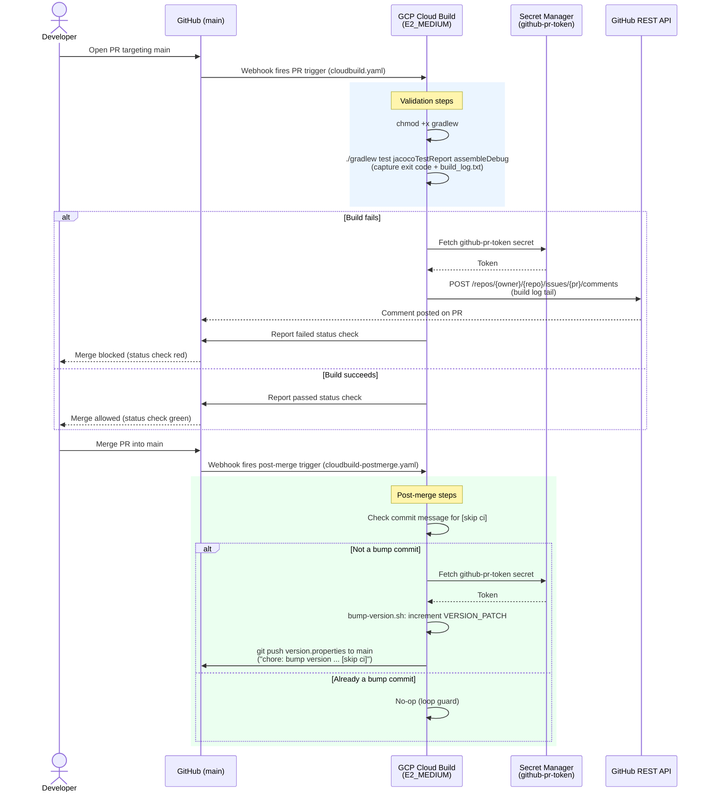

# CI/CD Architecture — mini-android-app

This document describes the end-to-end pull-request validation and release
pipeline for `mini-android-app`, built on GCP Cloud Build and GitHub, at
zero (or near-zero) cost.

## Design note: `E2_STANDARD_2` vs `E2_MEDIUM`

The original spec calls for the `E2_STANDARD_2` Cloud Build machine type.
Cloud Build's `options.machineType` field only accepts one of:
`E2_MEDIUM`, `E2_HIGHCPU_8`, `E2_HIGHCPU_32`, `N1_HIGHCPU_8`,
`N1_HIGHCPU_32` (or unset, which defaults to `E2_MEDIUM`). There is no
`E2_STANDARD_2` value — a config using it would be rejected by Cloud Build
at submit time. Both `cloudbuild.yaml` and `cloudbuild-postmerge.yaml` use
`E2_MEDIUM` instead, which is also the exact machine type covered by GCP
Cloud Build's always-free allotment of **120 build-minutes/day**. If you
need more CPU for larger projects later, moving to `E2_HIGHCPU_8` is a
one-line change — just note it falls outside the free tier.

## Components

| Component | Role |
|---|---|
| GitHub repo (`main` branch protected) | Source of truth, PR workflow |
| Cloud Build GitHub App trigger — PR | Runs `cloudbuild.yaml` on every PR targeting `main` |
| Cloud Build GitHub App trigger — push | Runs `cloudbuild-postmerge.yaml` on every push to `main` |
| Secret Manager secret `github-pr-token` | Fine-grained GitHub PAT, injected into both pipelines |
| `jacoco.gradle` | Coverage reporting, bound to `testDebugUnitTest` |
| `bump-version.sh` | Increments `VERSION_PATCH`, commits, pushes with `[skip ci]` |

## End-to-end lifecycle

1. **Developer opens a PR** targeting `main`.
2. GitHub notifies Cloud Build via the installed GitHub App, which fires the
   **PR trigger** and runs `cloudbuild.yaml` on an `E2_MEDIUM` worker.
3. The pipeline runs `./gradlew test jacocoTestReport assembleDebug`
   as a single step, redirecting all output to `build_log.txt`. The step
   captures Gradle's exit code to a file instead of failing immediately —
   this lets the pipeline still run the notification step below even on
   failure.
4. **On failure:** a dedicated step fetches the `github-pr-token` secret
   from Secret Manager, resolves the open PR for the current commit via the
   GitHub REST API (`GET /repos/{owner}/{repo}/commits/{sha}/pulls`), and
   posts the last 60 lines of `build_log.txt` plus a link to the full Cloud
   Build log as a PR comment. A final step then re-exits with the original
   Gradle exit code so Cloud Build — and therefore the GitHub commit status
   check — reports failure. Branch protection (configured in
   `SETUP_GUIDE.md`) blocks merging while that check is red.
5. **On success:** the same final step exits `0`, the GitHub status check
   goes green, and the PR becomes mergeable (still subject to any other
   configured branch protection rules).
6. **Post-merge:** once the PR is merged, the push to `main` fires the
   **post-merge trigger**, which runs `cloudbuild-postmerge.yaml`. A guard
   step first checks whether the triggering commit message contains
   `[skip ci]` — if so (i.e. this *is* a previous bump commit) it does
   nothing, preventing an infinite loop. Otherwise, `bump-version.sh` runs:
   it increments `VERSION_PATCH` in `version.properties`, commits with the
   repo owner's git identity, and pushes straight to `main` with
   `[skip ci]` in the message so the push does not re-trigger PR-style
   validation.

## Diagram

## Why these design choices

- **Single validation step, exit-code file, final enforcement step**
  instead of letting Gradle fail the step directly — Cloud Build stops
  processing subsequent steps as soon as one fails, which would skip the
  PR-comment step entirely. Capturing the exit code and deferring failure
  to the last step guarantees the comment is posted *and* the GitHub
  status check still ends up red.
- **Resolving the PR number from the commit SHA** (via
  `GET /repos/{owner}/{repo}/commits/{sha}/pulls`) rather than relying on a
  trigger-supplied PR-number substitution — the set of substitutions Cloud
  Build's GitHub App auto-populates for PR-event triggers has changed
  across versions and isn't guaranteed. The commit-SHA lookup is stable
  GitHub API behavior and works regardless of trigger configuration.
- **`[skip ci]` + explicit commit-message guard** — Cloud Build's push
  trigger has no native "ignore commits matching X" filter (only
  path-based include/ignore filters), so the guard is implemented as the
  first step of `cloudbuild-postmerge.yaml` itself.
- **Single reused PAT (`github-pr-token`)** for both commenting on PRs and
  pushing the version bump — see `SETUP_GUIDE.md` for the exact permission
  scopes required so the same token covers both flows.
- **Android lint is deliberately not run in PR validation.** With a warm
  Gradle cache the validation step still took 8m 26s, which showed the
  bottleneck was task execution rather than dependency downloads — and lint is
  among the most expensive tasks on a 2-vCPU worker. It is omitted to keep PR
  feedback fast and stay well inside the 120 free build-minutes/day. The
  trade-off is real: nothing in CI currently enforces lint, so it has to be
  run locally (`./gradlew lint`) or added to a slower non-blocking pipeline if
  that stops being acceptable.
- **Gradle cache round-tripped through GCS.** Cloud Build starts every build
  from a clean container, so without a cache each run re-downloads the Gradle
  distribution (~130 MB, fetched by the wrapper) plus AGP, Kotlin and androidx
  from Maven Central. The cache is restored before the build and written back
  after it, covering `wrapper/dists` and `caches/modules-2` under a
  `GRADLE_USER_HOME` placed inside `/workspace` — the only path shared between
  build steps. It is stored uncompressed, since the contents are already-
  deflated jars and gzip would spend CPU on a 2-vCPU worker for almost no size
  win. The save step runs *before* `enforce-build-status` so that failing
  builds still warm the cache instead of leaving a run of red builds paying
  the cold-start cost repeatedly.
